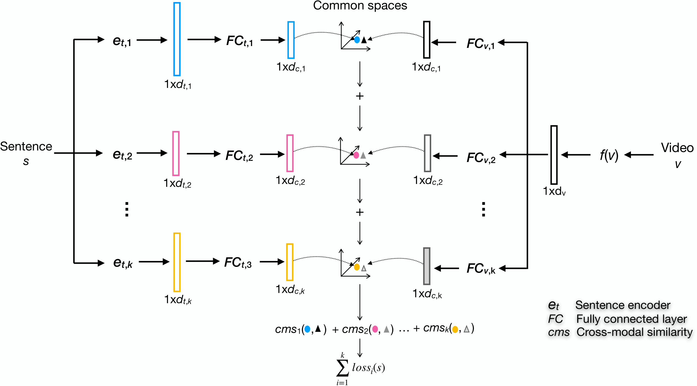

# Sea
Souce code of the papar: [SEA: Sentence Encoder Assembly for Video Retrieval by Textual Queries](https://arxiv.org/abs/2011.12091). 




The code assumes [video-level CNN features](https://github.com/xuchaoxi/video-cnn-feat) have been extracted. 


## Environment
* Ubuntu 16.04
* cuda 10.1
* python 3.7
* PyTorch 1.4.0
* tensorboard 2.1.0
* numpy 1.16.4

We used Anaconda to setup a deep learning workspace that supports PyTorch. Run the following script to install the required packages.

```
conda create -n sea python==3.7
conda activate sea
git clone https://github.com/li-xirong/sea.git
cd sea
pip install -r requirements.txt
```

## Required Data

### word2vec pretrained model
light version
universal version

### msrvtt10k dataset
FeatureData TextData VideoSets

### AVS dataset

### tgif dataset

### msvd datast


## SEA on msrvtt10k

#### Repoted performance on msrvtt10k
<!-- + [w2vvpp_resnext101_resnet152_subspace_v190916.pth.tar](http://lixirong.net/data/mm2019/w2vvpp_resnext101_resnet152_subspace_v190916.pth.tar)(240 MB) -->

Sentence encoder | Model | R@1 | R@5 | R@5 | Med r | mAP|
|--- | ---| ---| ---| ---| ---| ---|
|{BoW, w2v}| w2vv++| 10.9| 29.1| 39.9| 19| 20.2|
| | SEA| 11.6| 30.6| 41.6| 17| 21.3(↑5.4%) |
|{BoW, w2v, GRU}|w2vv++|11.1 |29.6 |40.5 |18 |20.6 |
||SEA|12.2 |31.9 |43.1 |15 |22.1(↑7.3%) |
|{BoW, w2v, bi-GRU}|w2vv++|11.3 | 29.9 |40.6 |18 |20.8|
||SEA|12.4 |32.1 |43.3 |15 |22.3(↑7.2%)|
|{BoW, w2v, BERT}|w2vv++|12.3 |31.8 |43.0 |15 |22.2|
||SEA|12.8 |33.1| 44.6 |14 |23.0(↑3.6%)|
|{BoW, w2v, GRU, BERT}|w2vv++|12.1 |31.7 |42.7 |16 |22.0|
||SEA|13.0 |33.6| 44.9| 14 |23.3(↑5.9%)|
|{BoW, w2v, biGRU, BERT}|w2vv++|12.0 |31.3 |42.3| 16 |21.8|
||SEA|13.1 |33.4| 45.0| 14 |23.3(↑6.9%)|


## SEA on AVS
to do

## SEA on tgif
to do

## SEA on msvd

to do


_____
_____


## Data

The sentence encoding network for W2VV++, namely ```MultiScaleTxtEncoder```, needs a pretrained word2vec (w2v) model. In this work, we use a w2v trained on English tags associated with 30 million Flickr images.  Run the following script to download the Flickr w2v model and extract the folder at $HOME/VisualSearch/. The zipped model is around 3.1 gigabytes, so the download may take a while.

```bash
ROOTPATH=$HOME/VisualSearch
mkdir -p $ROOTPATH; cd $ROOTPATH

# download and extract pre-trained word2vec
wget http://lixirong.net/data/w2vv-tmm2018/word2vec.tar.gz
tar zxf word2vec.tar.gz
```

The following three datasets are used for training, validation and testing: tgif-msrvtt10k, tv2016train and iacc.3. For more information about these datasets, please see https://github.com/li-xirong/avs.


**Video feature data**
+ 4096-dim resnext101-resnet152: [tgif-msrvtt10k](http://lixirong.net/data/mm2019/tgif-msrvtt10k-mean_resnext101-resnet152.tar.gz)(1.6G), [tv2016train](http://lixirong.net/data/mm2019/tv2016train-mean_resnext101-resnet152.tar.gz)(2.9M), [iacc.3](http://lixirong.net/data/mm2019/iacc.3-mean_resnext101-resnet152.tar.gz)(4.7G)

```bash
# get visual features per dataset
wget http://lixirong.net/data/mm2019/tgif-msrvtt10k-mean_resnext101-resnet152.tar.gz
wget http://lixirong.net/data/mm2019/tv2016train-mean_resnext101-resnet152.tar.gz
wget http://lixirong.net/data/mm2019/iacc.3-mean_resnext101-resnet152.tar.gz
```

**Sentence data**
+ Sentences: [tgif-msrvtt10k](http://lixirong.net/data/mm2019/tgif-msrvtt10k-sent.tar.gz), [tv2016train](http://lixirong.net/data/mm2019/tv2016train-sent.tar.gz)
+ TRECVID 2016 / 2017 / 2018 AVS topics and ground truth: [iacc.3](http://lixirong.net/data/mm2019/iacc.3-avs-topics.tar.gz)
+ TRECVID 2019 AVS topics and ground truth: [v3c1](http://lixirong.net/data/tv19/v3c1-avs-topics.tar.gz)

```bash
# get sentences
wget http://lixirong.net/data/mm2019/tgif-msrvtt10k-sent.tar.gz
wget http://lixirong.net/data/mm2019/tv2016train-sent.tar.gz
wget http://lixirong.net/data/mm2019/iacc.3-avs-topics.tar.gz
```


**Pre-trained models**
+ [w2vvpp_resnext101_resnet152_subspace_v190916.pth.tar](http://lixirong.net/data/mm2019/w2vvpp_resnext101_resnet152_subspace_v190916.pth.tar)(240 MB)

Model | TV16 | TV17 | TV18 | OVERALL
|--- | ---| ---| ---| ---|
|w2vvpp_resnext101_resnet152_subspace_v190916 | 0.162 | 0.223 | 0.101 | 0.162 |

Model | TV19|
|--- | ---|
|w2vvpp_resnext101_resnet152_subspace_v190916 | 0.139|

Note that due to SGD based training, the performance of a single model learned from scratch might differ slightly from those reported in the ACMMM'19 paper. For better and stable performance, ensemble is suggested.

### Scripts for training, testing and evaluation

Before executing the following scripts, please check if the environment (data, software, etc) is ready by running [test_env.py](test_env.py):
```bash
python test_env.py

test_rootpath (__main__.TestSuite) ... ok
test_test_data (__main__.TestSuite) ... ok
test_train_data (__main__.TestSuite) ... ok
test_val_data (__main__.TestSuite) ... ok
test_w2v_dir (__main__.TestSuite) ... ok

----------------------------------------------------------------------
Ran 5 tests in 0.001s

OK
```

#### Do everything from sratch

```bash
source ~/w2vvpp/bin/activate
# build vocabulary on the training set
./do_build_vocab.sh

# train w2vvpp on tgif-msrvtt10k based on config "w2vvpp_resnext101-resnet152_subspace"
trainCollection=tgif-msrvtt10k
valCollection=tv2016train
val_set=setA
model_config=w2vvpp_resnext101-resnet152_subspace

./do_train.sh $trainCollection $valCollection $val_set $model_config

# test w2vvpp on iacc.3
model_path=$rootpath/$trainCollection/w2vvpp_train/$valCollection/$val_set/$model_config/runs_0/model_best.pth.tar
sim_name=$trainCollection/$valCollection/$val_set/$model_config/runs_0

./do_test.sh iacc.3 $model_path $sim_name tv16.avs.txt,tv17.avs.txt,tv18.avs.txt

cd tv-avs-eval
./do_eval.sh iacc.3 tv16 $sim_name
./do_eval.sh iacc.3 tv17 $sim_name
./do_eval.sh iacc.3 tv18 $sim_name
```

#### Test and evaluate a pre-trained model

Assume the model has been placed at the following path:

```bash
~/VisualSearch/w2vvpp/w2vvpp_resnext101_resnet152_subspace_v190916.pth.tar
```

```bash

# apply a pre-trained w2vvpp model on iacc.3 for answering tv16 / tv17 / tv18 queries

./do_test.sh iacc.3 ~/VisualSearch/w2vvpp/w2vvpp_resnext101_resnet152_subspace_v190916.pth.tar w2vvpp_resnext101_resnet152_subspace_v190916 tv16.avs.txt,tv17.avs.txt,tv18.avs.txt

# evaluate the performance
cd tv-avs-eval
./do_eval.sh iacc.3 tv16 w2vvpp_resnext101_resnet152_subspace_v190916 # tv16 infAP: 0.162
./do_eval.sh iacc.3 tv17 w2vvpp_resnext101_resnet152_subspace_v190916 # tv17 infAP: 0.223
./do_eval.sh iacc.3 tv18 w2vvpp_resnext101_resnet152_subspace_v190916 # tv18 infAP: 0.101
```

```bash
# apply a pre-trained w2vvpp model on v3c1 for answering tv19 queries
./do_test.sh v3c1 ~/VisualSearch/w2vvpp/w2vvpp_resnext101_resnet152_subspace_v190916.pth.tar w2vvpp_resnext101_resnet152_subspace_v190916 tv19.avs.txt
# evaluate the performance
cd tv-avs-eval
./do_eval.sh v3c1 tv19 w2vvpp_resnext101_resnet152_subspace_v190916 # tv19 infAP: 0.139
```

## Tutorials

<!-- 1. [Use a pre-trained w2vv++ model to encode a given sentence](tutorial.ipynb) -->


## References

```
@ARTICLE{tmm2020-sea,
  title={SEA: Sentence Encoder Assembly for Video Retrieval by Textual Queries}, 
  author={Xirong Li and Fangming Zhou and Chaoxi Xu and Jiaqi Ji and Gang Yang},
  journal={IEEE Transactions on Multimedia}, 
  year={2020},
  doi={10.1109/TMM.2020.3042067}}
```
